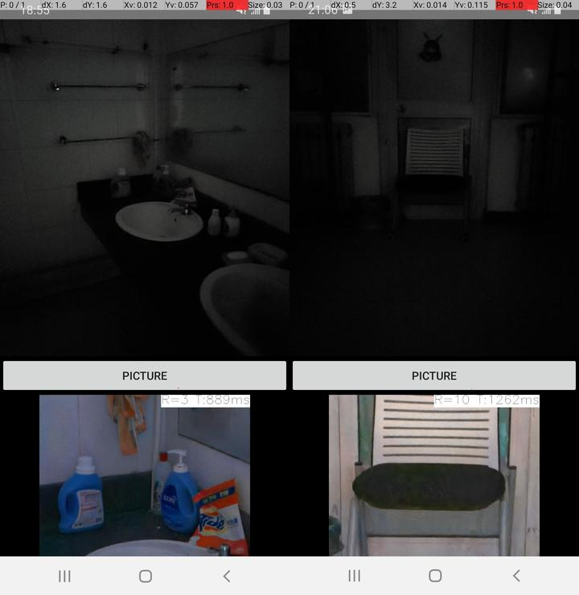

# 本项目是将CVPR2018的“Learning to See in the Dark”的暗光成像，用ncnn在安卓上进行简单的部署实现。

### Learning to See in the Dark是什么？
“Learning to See in the Dark”的主要工作是用了一个U-net like的模型，将摄像头原始输出的RAW图像，进行暗光增强，输出RGB图像。Paper具体内容可以去看知乎文章：https://zhuanlan.zhihu.com/p/397150704

## 项目说明
本项目有三个文件夹，分三个大的工作步骤，按照操作顺序说明一下(每一个文件夹里面都有单独的README具体说明)：
1. SID：对SID的模型进行简单的测试，同时进行模型的转换：ckpt->pb->onnx->onnx->ncnn
2. Win：在windows上对上一步生成的ncnn模型，进行测试
3. Camera2Raw：在安卓上用ncnn部署生成的ncnn模型。
4. Images：一些测试结果图

按理说上面这些是要按顺序都跑一遍的，但我已经把各个部分的结果都跑出来了，所以可以随便用了。

## 效果

## Bug
安卓的工程，经过测试发现不同的手机效果不太一样，有些手机可能app能使用，但是效果出不来。
1. 目前测试效果正常的有：Samsung Galaxy S9
2. 目前测试效果不正常的有：Xiaomi 8

## 相关依赖参考
Learning to See in the Dark(用了它提供的训练好了的模型)：https://github.com/cchen156/Learning-to-See-in-the-Dark

windows上运行ncnn模型：https://github.com/EdVince/Ncnn-Win/tree/main/vs2019_ncnn_opencv-mobile_demo

Android相机获取RAW图像：https://github.com/EdVince/Android_learning/tree/main/Camera2Raw
